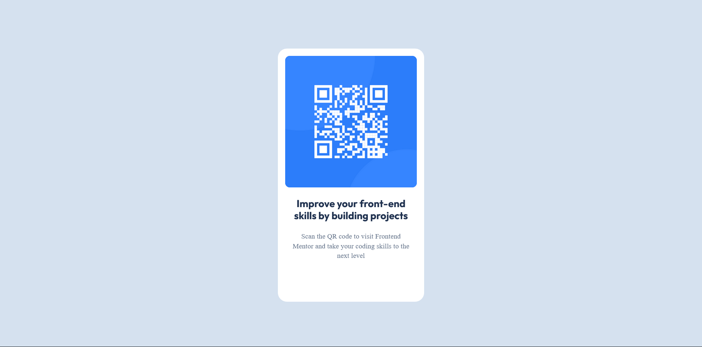

# Frontend Mentor - QR code component solution

This is a solution to the [QR code component challenge on Frontend Mentor](https://www.frontendmentor.io/challenges/qr-code-component-iux_sIO_H).
  
## Table of contents

- [Overview](#overview)

- [Screenshot](#screenshot)

- [Links](#links)

## Overview

### Screenshot

- Desktop   

- Mobile

### Links

- Solution URL: [Frontend Mentor Solution](https://your-solution-url.com)

- Live Site URL: [Qr Code](https://qrcode-chrisdzasc.netlify.app/)